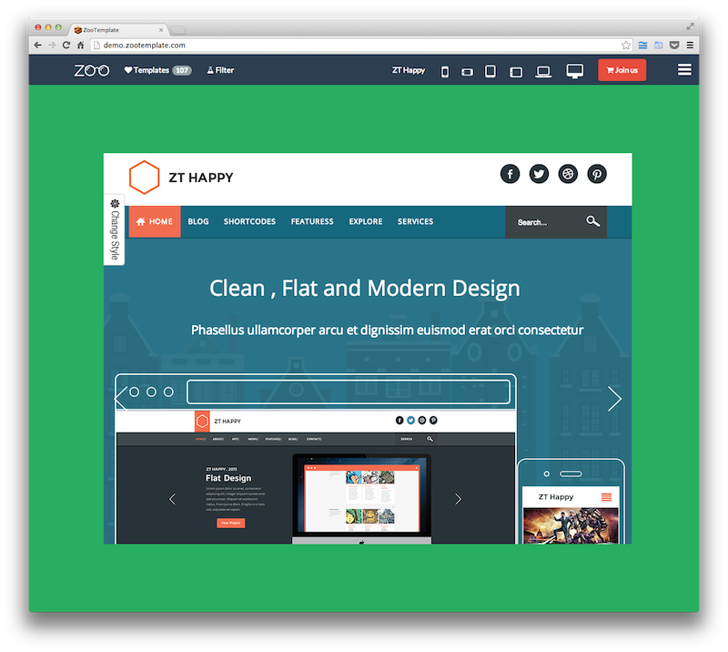

Template Managers
=================

Our front-end and back-end for Joomla and Magento demo templates.



Other screenshots:

* [Administrator back-end](docs/img/backend-admin.png)
* [Account back-end](docs/img/backend-account.png)

## Vision

The software is used to manage the templates/extensions of Joomla, Magento, Wordpress, Drupal, etc.
If your company sell, provide these kind of templates, extensions, then this software is exactly for you.

The software has been used in production at [ZooTemplate](http://demo.zootemplate.com), one of the top Joomla templates/extensions provider in the world.

## Platform

The software is built on [MEAN stack](http://mean.io) which uses the following software:

* [M - MongoDB](http://mongodb.org)
* [E - Express](http://expressjs.com)
* [A - AngularJS)(http://angularjs.org)
* [N - NodeJS](http://nodejs.org)

In the details, the software listed below must be installed on your server:

* [Amember](http://www.amember.com): The membership software. Amember users can use their account name/password to sign in and download the file from our back-end
* [MongoDB](http://mongodb.org): Database server
* [NodeJS](http://nodejs.org): NodeJS web server
* [Nginx](http://nginx.org): A web server. You can use other one such as [Apache HTTP server](http://httpd.apache.org)
* [ImageMagick CLI](http://www.imagemagick.org): for generating templates/extensions thumbnails
* [forever](https://github.com/nodejitsu/forever): for watching, running the app forever without restarting the NodeJS server when updating the source code
* [npm](http://npmjs.org): for installing NodeJS modules

## Installing

Below is the list of steps to install the app:

* [Download the latest versions](https://github.com/nghuuphuoc/templatemanager/releases)
* Unzip and copy the ```src``` directory to particular directory that you want to store the app
* From the destination directory, execute the command:

```bash
$ sudo npm install
```

The command will install NodeJS modules which are listed in ```package.json```.

### Preparing the database

From the Mongo shell, run the commands (assume that the app will use ```templatemanager_dev``` as the database):

```bash
> use templatemanager_dev;
> db.user.insert({first_name: 'Administrator', last_name: '', email: 'admin@domain.com', hashed_password: '41d4736be7061d0dd826085dd5c5c773c4703e8a', salt: '1000412025288', username: 'administrator', role: 'root', locked: false });
```

At this moment, you can use the administrator account with username as ```administrator```, password as ```123456``` to manage the data in the back-end.
Of course, when the app is ready to launch, you can sign in and change the password later.

Next, index the database by commands:

```bash
> db.download.ensureIndex({ user_name: 1, downloaded_date: 1 });
> db.file.ensureIndex({ last_download: 1, num_downloads: 1 });
> db.package.ensureIndex({ type: 1 });
> db.package.ensureIndex({ created_date: 1 });
> db.package.ensureIndex({ slug: 1 });
> db.package.ensureIndex({ year: 1 });
> db.package.ensureIndex({ tag: 1, responsive: 1, high_resolution: 1 });
> db.user.ensureIndex({ email: 1 });
> db.user.ensureIndex({ username: 1 });
```

### Preparing the domains

### Setting

### Running

After completing all the steps above, the app is ready to launch.

Since the app is written in NodeJS, you can run it like other NodeJS app:

```bash
$ NODE_ENV=<the environment> PORT=<the listening port> node app.js
```

I also provide a shell script (```start.sh```) for running the app forever (the *forever* word means that you don't have to
restart the NodeJS server whenever you update the source code):

```
$ chmod 755 start.sh
$ nohup start.sh >> /var/log/template_manager.log 2>&1 &
```

## License

Copyright (c) 2013 Nguyen Huu Phuoc

Licensed under the MIT license
